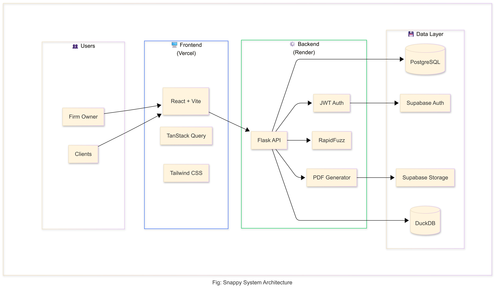

# SNAPPY - Professional Billing & Invoicing Platform

[](LICENSE)
[](https://snappy-billing.vercel.app)

> A full-stack, production-ready billing application built with **React**, **Flask** and **Supabase**. Deployed and serving real users.

## 🏗️ System Architecture



## 🎯 Project Highlights

| Aspect | Details |
|--------|---------|
| **Type** | Full-stack SaaS Application |
| **Status** | ✅ MVP in Production (Live) |
| **Users** | Multi-tenant with data isolation |
| **Deployment** | CI/CD via GitHub → Vercel + Render |
| **Development Time** | ~1 weeks |

## ✨ Key Features

### Core Functionality
- 📄 **Invoice CRUD** - Full lifecycle management with status tracking
- 👥 **Client Management** - Contact database with fuzzy search
- 🎨 **PDF Generation** - Professional invoices with custom templates
- 📊 **Analytics Dashboard** - Revenue trends, top clients, aging analysis

### Technical Highlights
- 🔐 **JWT Authentication** - Secure token-based auth via Supabase
- ⚡ **Multi-tenant Architecture** - Complete data isolation per user
- 🔍 **Fuzzy Search** - RapidFuzz-powered intelligent matching
- 📈 **DuckDB Analytics** - High-performance OLAP for reporting
- �️ **Image Caching** - Optimized logo/signature loading
- 📥 **Bulk Import** - CSV import with validation & deduplication

## 🛠️ Tech Stack

| Layer | Technology |
|-------|------------|
| **Frontend** | React 18 + TypeScript + Vite |
| **Styling** | Tailwind CSS |
| **State Management** | TanStack Query (React Query) |
| **Backend** | Flask (Python 3.11) |
| **Database** | PostgreSQL (Supabase) |
| **Authentication** | Supabase Auth (JWT) |
| **File Storage** | Supabase Storage |
| **PDF Engine** | ReportLab |
| **Analytics DB** | DuckDB |
| **Search** | RapidFuzz |
| **Frontend Hosting** | Vercel |
| **Backend Hosting** | Render |

## 🧠 Technical Decisions & Rationale

### Why Flask over FastAPI?
- Mature ecosystem with ReportLab for PDF generation
- Simpler deployment on Render with Gunicorn
- Sufficient for current scale; async not required

### Why Supabase over Firebase?
- PostgreSQL flexibility for complex queries
- Row Level Security (RLS) for multi-tenancy
- Unified auth, database, and storage

### Why DuckDB for Analytics?
- Embedded OLAP database - no separate server
- 10x faster aggregations than PostgreSQL for analytics
- Per-user data sync with 24-hour TTL caching

### Why TanStack Query over Redux?
- Built-in caching and deduplication
- Automatic background refetching
- Simpler mental model for server state

## 📁 Project Structure

```
snappy/
├── backend/                 # Flask REST API
│   ├── app/
│   │   ├── api/            # Route handlers
│   │   │   ├── auth.py     # User & firm management
│   │   │   ├── clients.py  # Client CRUD + fuzzy search
│   │   │   ├── invoices.py # Invoice CRUD + PDF generation
│   │   │   └── analytics.py
│   │   ├── models/         # SQLAlchemy ORM models
│   │   ├── services/       # Business logic
│   │   │   ├── pdf_templates.py  # ReportLab PDF generation
│   │   │   └── duckdb_service.py # Analytics engine
│   │   └── middleware/     # JWT validation
│   └── requirements.txt
│
├── frontend/               # React SPA
│   ├── src/
│   │   ├── pages/         # Route components
│   │   ├── components/    # Reusable UI components
│   │   ├── contexts/      # React Context (Auth)
│   │   └── api.ts         # Type-safe API client
│   └── package.json
│
└── snappy_arc.png         # Architecture diagram
```

## � Security Implementation

- **Authentication**: Supabase JWT with HS256 verification
- **Authorization**: All queries filtered by `user_id` from JWT
- **Data Isolation**: Multi-tenant design - users cannot access others' data
- **Storage Security**: Signed URLs with expiration for images
- **Input Validation**: Server-side validation on all endpoints


## 🚀 Deployment

### Frontend (Vercel)
- Auto-deploy on push to `main`
- Environment variables configured in Vercel dashboard

### Backend (Render)
- Web Service with auto-deploy
- Gunicorn WSGI server
- PostgreSQL via Supabase (external)

## 📈 Performance Optimizations

1. **Template Shell Caching** - Pre-cache static PDF elements per user
2. **Image Caching** - In-memory cache for logos/signatures
3. **JWT Secret Caching** - Single load, not per-request
4. **DuckDB Sync Throttling** - Once per 24 hours per user
5. **TanStack Query** - Client-side caching with stale-while-revalidate

## 🎓 Skills Demonstrated

- **Full-Stack Development** - React frontend + Flask backend
- **Database Design** - Multi-tenant PostgreSQL schema
- **Authentication** - JWT implementation with Supabase
- **API Design** - RESTful endpoints with proper error handling
- **State Management** - TanStack Query for server state
- **PDF Generation** - Programmatic PDF creation with ReportLab
- **Cloud Deployment** - Vercel + Render with CI/CD
- **Performance Optimization** - Caching strategies, query optimization

## 📝 License

Dual License - Free for educational/non-commercial use. Commercial use requires a paid license - see [LICENSE](LICENSE)

---

**Built by Parth Nuwal** | [GitHub](https://github.com/Parthnuwal7) | [LinkedIn](www.linkedin.com/in/parth-nuwal-9a81b9226)
